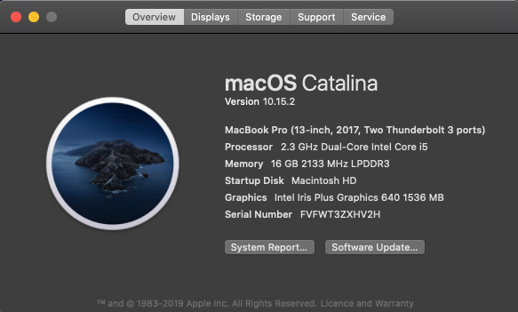

## My Development Setup 🖥

Sometimes I get asked for my development setup and the apps I use for my everyday work. This is a living page meant to contain it all. 

### Hardware

- [Macbook Pro 13"](https://www.apple.com/au/macbook-pro-13/): I have used windows, linux and Mac both professionally and as a hobbyist. Although I was on Ubuntu for a couple of years, nothing beats the general ease of use and dev friendliness of a Mac

- [Dell Ultrasharp 32" 4K Monitor](https://www.amazon.com.au/32-Inch-Screen-LED-Lit-Monitor-U3219Q/dp/B07HDBD9CM): I use a 4K monitor at home to do all my dev and creative (photo editing) work

- [Apple Magic Trackpad 2](https://www.apple.com/au/shop/product/MJ2R2ZA/A/magic-trackpad-2-silver) and [Logitech MX Master 3](https://www.logitech.com/en-au/product/mx-master-3) (I alternate 🤓)

- [Keychron K2 Mechanical Keyboard with Brown Switches](https://www.keychron.com/products/keychron-k2-mechanical-keyboard?variant=31063869653081)

- Airpods

- iPhone 11 Pro

## Software

My dotfiles can be found [here](https://github.com/shavz/dotfiles)

### Development Tools

- [iTerm2](https://iterm2.com): I use this as my main terminal with zsh and oh my zsh installed.
- [IntelliJ IDEA Ultimate](https://www.jetbrains.com/idea/): My IDE of choice. I do all my backend heavy and enterprise work in this. I use this ultimate version as the framework support alone (excluding all the other ultimate perks) makes it more than worth the money
- [Visual Studio Code](https://code.visualstudio.com): For my web dev and as a general text editor
- [Docker](https://www.docker.com): For pakaging all my apps before deployment
- [Postico](https://eggerapps.at/postico/): As my database browser of choice
- [Github](https://github.com): My code repository of choice
- [Digital Ocean](https://www.digitalocean.com): I find these guys good value for money compared to AWS for hobby projects
- [Netlify](https://www.netlify.com): Use it to host this blog, they are a delight to work with
- [Safari](https://www.apple.com/au/safari/)/[Brave Browser](https://brave.com): Safari for my daily browsing and Brave when I need to use chromium dev tools
- [Postman](https://www.getpostman.com): For api testing

### Apps

- [1Password](https://1password.com) for managing my logins and passwords
- [Bear](https://bear.app) for note taking
- [ON1 Photo RAW](https://www.on1.com) for editing my DSLR photos
- [Pixelmator Pro](https://www.pixelmator.com/pro/) for creating logos and vector graphic editing
- [Rocket](https://matthewpalmer.net/rocket/) for amazing emoji support everywhere
- [Slack](https://slack.com/intl/en-au/) for work and dev community chats
- [Trello](https://trello.com/en) for managing my personal development to-do boards
- [NordVPN](https://nordvpn.com) for when you need VPN at an airport or a cafe
- [Magnet](https://apps.apple.com/au/app/magnet/id441258766?mt=12) for easy window tiling
- [Lungo](https://apps.apple.com/us/app/lungo/id1263070803?mt=12) good replacement for caffeine, to keep my mac awake
- [Spotify](https://www.spotify.com/au/) for music
- [Dato](https://www.spotify.com/au/) good stock date/time replacement app
- [Wipr](https://apps.apple.com/au/app/wipr/id1320666476?mt=12) for a good adblock on safari